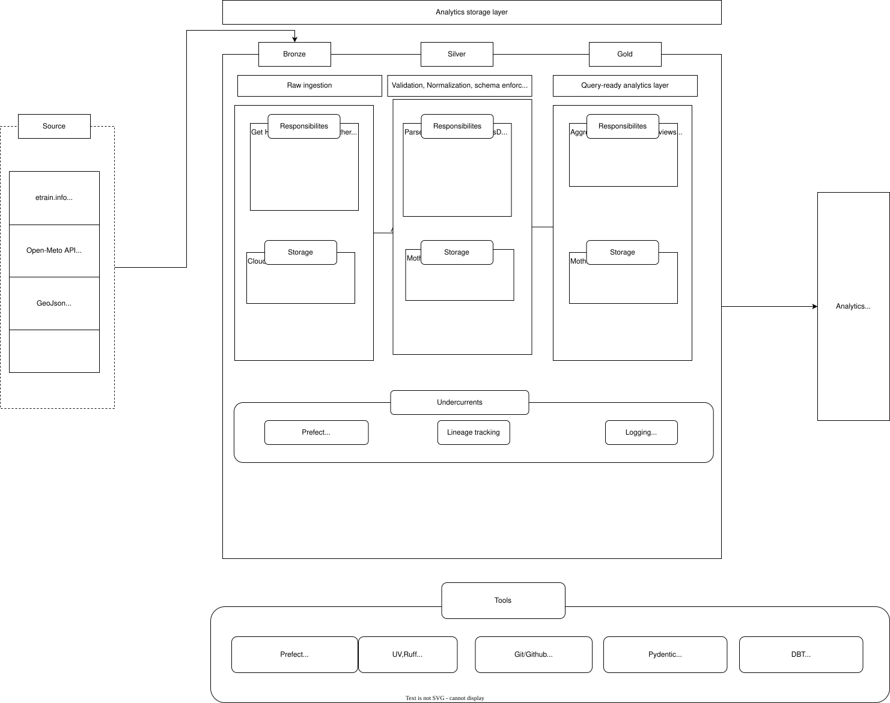
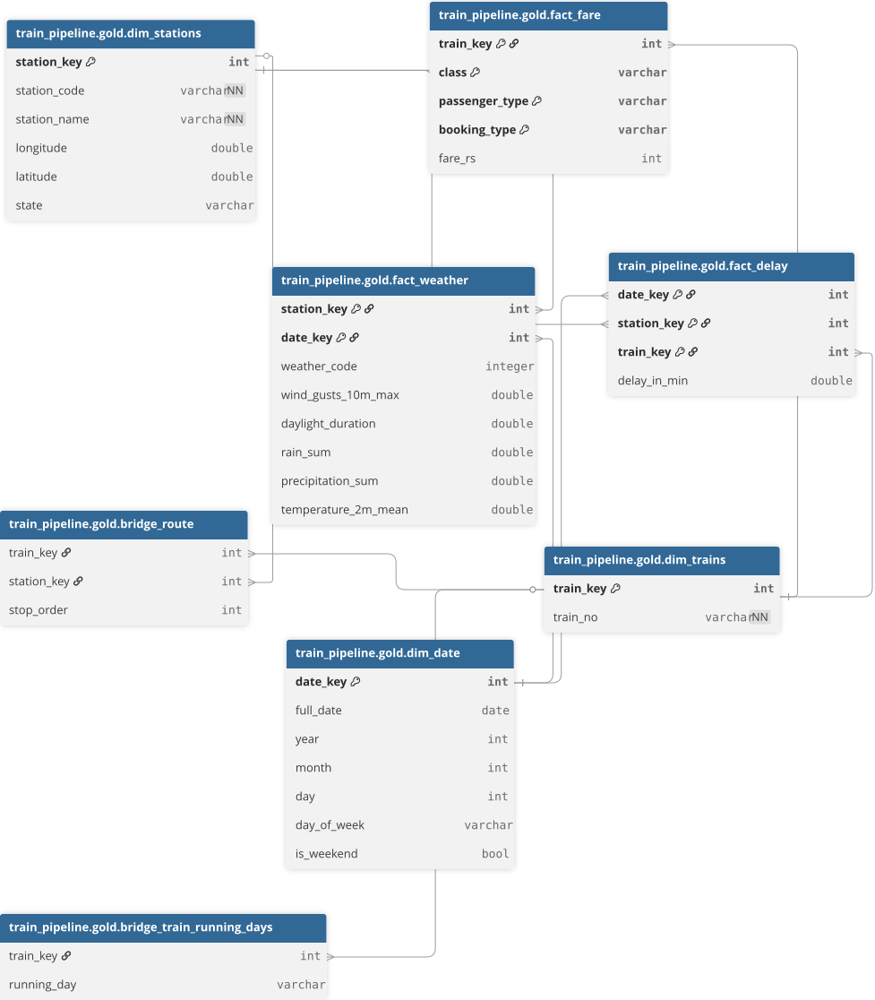
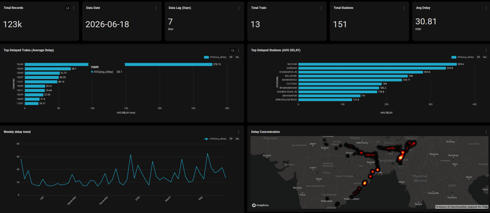

# Train Pipeline V2

An end-to-end data engineering pipeline that scrapes historical train delay data for Northeast India trains, enriches it with weather data, and builds analytics-ready marts to study how weather correlates with delays.

Built to practice production-grade data engineering patterns: medallion architecture, orchestration, idempotent ingestion, schema validation, and dimensional modeling.

## What it does

- Scrapes ~14 trains' one-year delay history from [etrain.info](https://etrain.info)
- Fetches daily weather (temperature, rain, wind, daylight, weather codes) per station from the [Open-Meteo](https://open-meteo.com) 
- Lands everything in S3, transforms it through bronze → silver → gold, and exposes marts for delay trends, station/train rankings, and weather–delay correlation

## Architecture


**Medallion layers**

- **Bronze** — Python owns all ingestion and S3 contact. Raw HTML and raw weather JSON land in S3; ingestion state is tracked in DuckDB metadata tables. Append-only, no primary keys.
- **Silver** — dbt takes over from landed data onward. Staging models read parquet/JSON from S3, deduplicate, cast types, and conform to a star schema.
- **Gold** — denormalized fact and dimension tables (`fact_delay`, `fact_weather`, `fact_fare`, `dim_stations`, `dim_trains`, `dim_date`) plus bridge tables for the train↔station route and running-days many-to-many relationships, feeding analytics marts.

**DIMENSIONAL TABLES**

**DASHBOARD**

## Tech stack

| Layer | Tools |
|---|---|
| Ingestion | `requests`, `BeautifulSoup` |
| Validation | `Pydantic`,
| Orchestration | `Prefect` |
| Warehouse | `DuckDB` / `MotherDuck` |
| Transformation | `dbt` (`dbt-duckdb`) |
| Storage | `AWS S3` 
| Tooling | `uv`, `Loguru` |

## Engineering decisions 

- **Idempotent ingestion** via SQL guards (`ON CONFLICT DO UPDATE` on natural keys) and skip-checks against metadata tables, so reruns update rather than duplicate.
- **Incremental + backfill weather modes** — each station fetches only from its last successful date forward; a backfill flag does a full historical pull.
- **Parallel where safe, sequential where required** — weather fetches run across a thread pool; train scraping stays sequential to respect rate limits.
- **Semantic null handling** — `delay = 0` (on time) and `delay IS NULL` (no data) are kept distinct rather than collapsed.
- **Deduplication in silver, not bronze** — bronze stays append-only; silver dedupes with `QUALIFY row_number() OVER (...)` keeping the latest run per record.
- **Data quality is documented, not hidden** — known coverage gaps (sparse rural stations, differing train frequencies) are explained in dbt docs as a source-data property, not a pipeline bug.

## Project layout

```
ingestion/        bronze fetching (etrain scraper, open-meteo client)
parsing/          HTML → structured records
transformations/  wide-to-long reshaping
storage/          object store (S3), readers, writers, DuckDB connection
orchestration/    Prefect flows, single argparse entry point
validators/       Pydantic models per layer
sql/              raw DDL / guard queries
dbt/              staging, intermediate, marts (dim / fact / bridge / analytics)
```

## Running it
Need a .env file in root with
- MOTHERDUCK_TOKEN=
- MOTHERDUCK_DATABASE_NAME=
- AWS_ACCESS_KEY_ID=
- AWS_SECRET_ACCESS_KEY=
- AWS_DEFAULT_REGION=
- S3_BUCKET=
```bash
uv sync

# full pipeline
python -m orchestration._main --force

#incremental 
python -m orchestration._main

# granular force flags
python -m orchestration._main --force-ingest --force-weather

# dbt transformations
cd dbt/train_pipeline
dbt build
```

## Roadmap

- A swappable `Warehouse` interface so DuckDB / Readshift adapters are interchangeable (V3). There by using duckdb for local developemnt while using redshift for prod 

- Scaling to atleast 50 trains

